# Skill Lantern — FYP Report Diagrams (Mermaid Live Editor Code)

> **How to use:** Copy each code block into [Mermaid Live Editor](https://mermaid.live) to render and export as PNG/SVG for your report.

---

## Figure 1: Functional Decomposition Diagram (FDD)

```mermaid
graph TD
    A["<b>Skill Lantern</b><br/>AI-Powered Career Guidance System"]

    A --> B["<b>User Management<br/>Subsystem</b>"]
    A --> C["<b>Career Prediction<br/>Subsystem</b>"]
    A --> D["<b>Roadmap Generation<br/>Subsystem</b>"]
    A --> E["<b>College Recommendation<br/>Subsystem</b>"]
    A --> F["<b>Recommendation<br/>Orchestration Subsystem</b>"]

    B --> B1["User Registration<br/>(Multi-step Signup)"]
    B --> B2["Authentication<br/>(NextAuth.js v5)"]
    B --> B3["Profile Storage<br/>(PostgreSQL / Prisma)"]

    C --> C1["XGBoost Model<br/>Inference"]
    C --> C2["Rule-Based<br/>Fallback"]
    C --> C3["Confidence<br/>Scoring"]
    C --> C4["Feature<br/>Encoding"]

    D --> D1["LLaMA 3 Prompt<br/>Engineering"]
    D --> D2["3-Stage Roadmap<br/>Structuring"]
    D --> D3["JSON Response<br/>Parsing"]

    E --> E1["CSV Data<br/>Loading"]
    E --> E2["Location / Budget<br/>Filtering"]
    E --> E3["LLM-Enhanced<br/>Explanations"]

    F --> F1["Career Prediction<br/>Coordination"]
    F --> F2["Roadmap<br/>Coordination"]
    F --> F3["College<br/>Coordination"]
    F --> F4["Summary<br/>Generation"]

    style A fill:#4F46E5,stroke:#3730A3,color:#fff,stroke-width:2px
    style B fill:#7C3AED,stroke:#6D28D9,color:#fff
    style C fill:#7C3AED,stroke:#6D28D9,color:#fff
    style D fill:#7C3AED,stroke:#6D28D9,color:#fff
    style E fill:#7C3AED,stroke:#6D28D9,color:#fff
    style F fill:#7C3AED,stroke:#6D28D9,color:#fff
```

---

## Figure 2: System Architecture Diagram

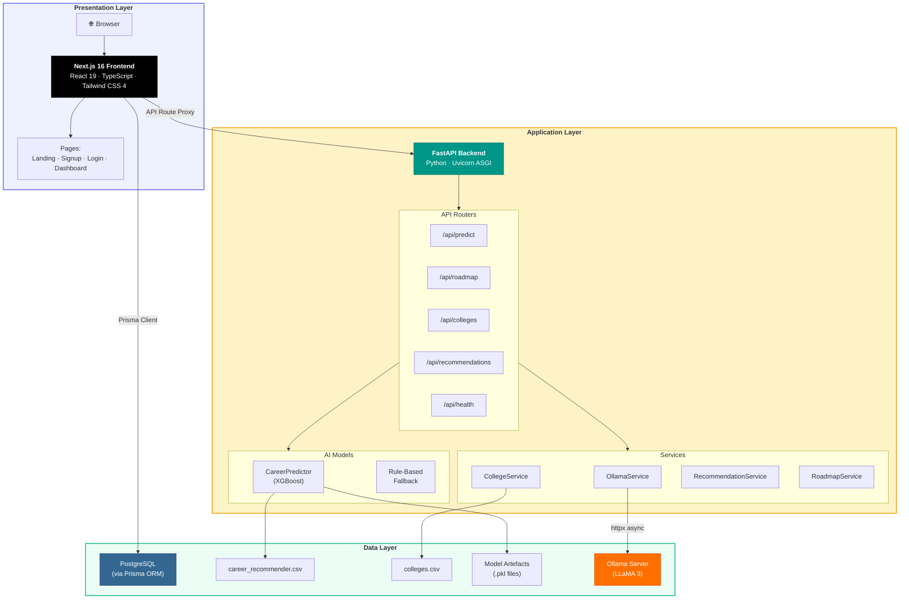

---

## Figure 3: Sequence Diagram — Career Prediction Flow

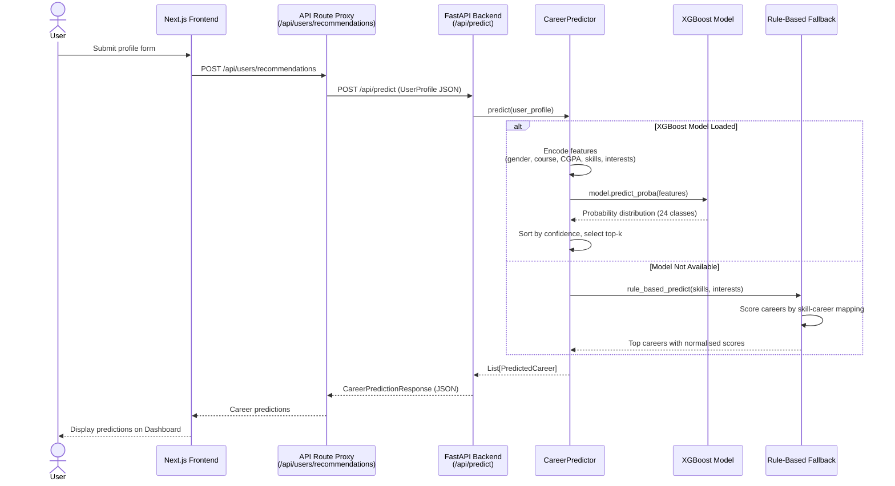

---

## Figure 4: Sequence Diagram — Full Recommendation Flow

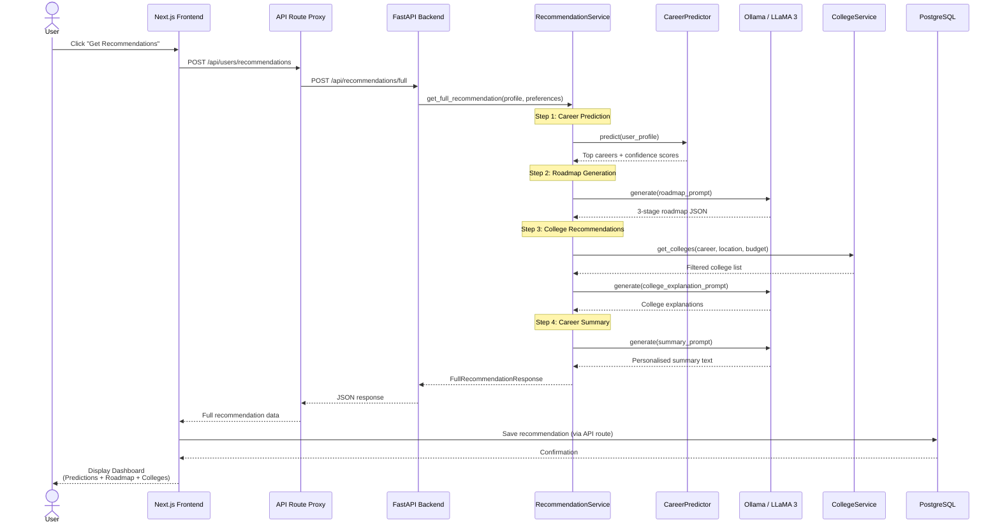

---

## Figure 5: Activity Diagram — User Registration and Profile Creation

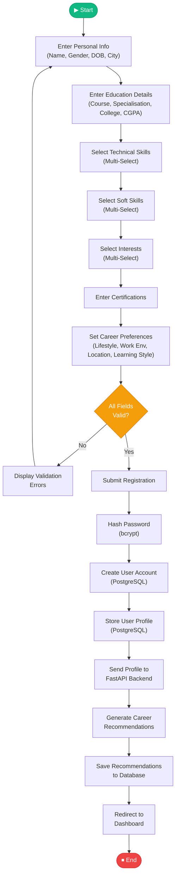

---

## Figure 6: Activity Diagram — Career Recommendation Generation

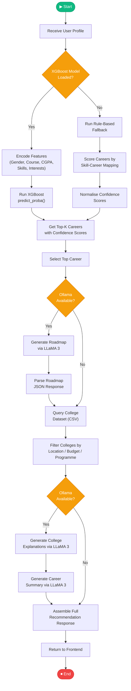

---

## Figure 7: Use Case Diagram

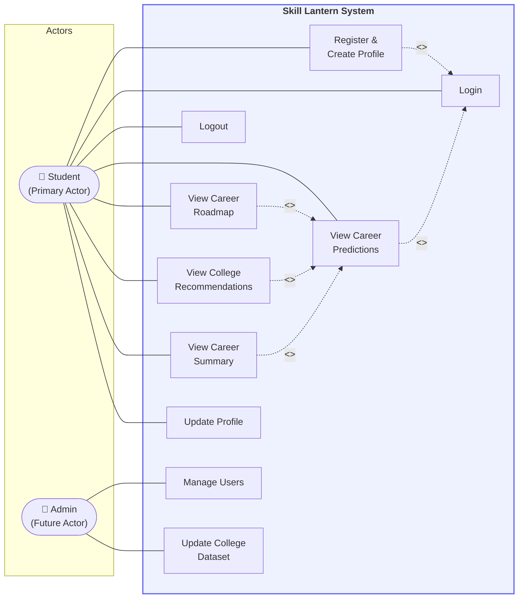

---

## Figure 8: Entity Relationship Diagram (ERD)

```mermaid
erDiagram
    User {
        string id PK "cuid()"
        string name
        string email UK
        datetime emailVerified
        string image
        string password
        datetime createdAt
        datetime updatedAt
    }

    UserProfile {
        string id PK "cuid()"
        string userId FK UK
        string fullName
        string gender
        datetime dateOfBirth
        string cityRegion
        string courseCategory
        string course
        string specialization
        string schoolCollegeName
        float cgpa
        string_array interests
        string_array technicalSkills
        string_array softSkills
        boolean hasCertification
        string certifications
        string careerLifestyle
        string workEnvironment
        string locationPreference
        string learningStyle
        datetime createdAt
        datetime updatedAt
    }

    CareerRecommendation {
        string id PK "cuid()"
        string userId FK
        json predictions "Array of career + confidence"
        string topCareer
        json roadmap "stages, tools, job_roles"
        json colleges "recommendations list"
        string summary
        string_array immediateActions
        boolean hasFullDetails
        datetime createdAt
        datetime updatedAt
    }

    Account {
        string id PK "cuid()"
        string userId FK
        string type
        string provider
        string providerAccountId
        string refresh_token
        string access_token
        int expires_at
        string token_type
        string scope
        string id_token
        string session_state
    }

    Session {
        string id PK "cuid()"
        string sessionToken UK
        string userId FK
        datetime expires
    }

    VerificationToken {
        string identifier
        string token UK
        datetime expires
    }

    User ||--o| UserProfile : "has one"
    User ||--o{ CareerRecommendation : "has many"
    User ||--o{ Account : "has many"
    User ||--o{ Session : "has many"
```

---

## Figure 9: Class Diagram

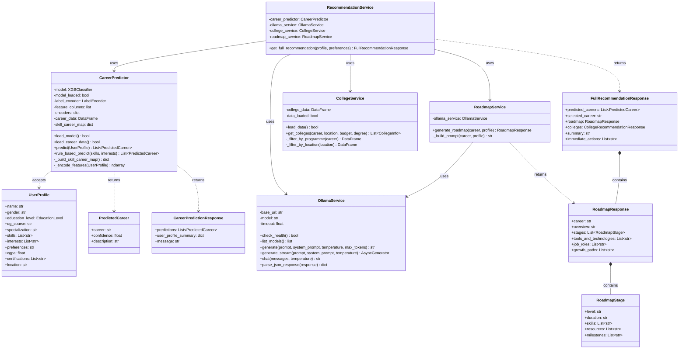

---

## Figure 10: XGBoost Training Pipeline Flow

```mermaid
flowchart LR
    A["📂 career_recommender.csv"] --> B["Load &<br/>Clean Data"]
    B --> C["Extract Job Titles<br/>& Map to 24<br/>Career Categories"]
    C --> D["Remove Students /<br/>Unemployed / Rare<br/>Categories"]
    D --> E["Feature Engineering"]

    subgraph FE["Feature Engineering"]
        E1["Gender →<br/>LabelEncoder"]
        E2["UG Course →<br/>LabelEncoder"]
        E3["CGPA →<br/>Normalise /100"]
        E4["Skills →<br/>Top 50 Binary"]
        E5["Interests →<br/>Top 30 Binary"]
        E6["Certifications →<br/>Binary 0/1"]
    end

    E --> FE

    FE --> F["Stratified Split<br/>80% Train / 20% Test"]
    F --> G["5-Fold Cross<br/>Validation"]
    F --> H["Train XGBoost<br/>(500 trees, depth=8,<br/>lr=0.05, softprob)"]
    H --> I["Evaluate:<br/>Accuracy, Top-3,<br/>Top-5, F1, CM"]
    I --> J["Save Artefacts<br/>(model.pkl,<br/>encoders.pkl)"]

    style A fill:#3B82F6,stroke:#2563EB,color:#fff
    style J fill:#10B981,stroke:#059669,color:#fff
```

---

## Figure 11: Data Flow Diagram (DFD Level 0 — Context)

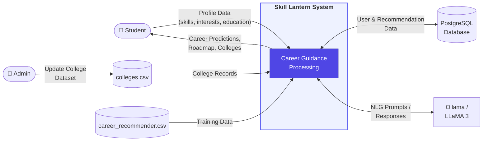

---

## Figure 12: Deployment Diagram

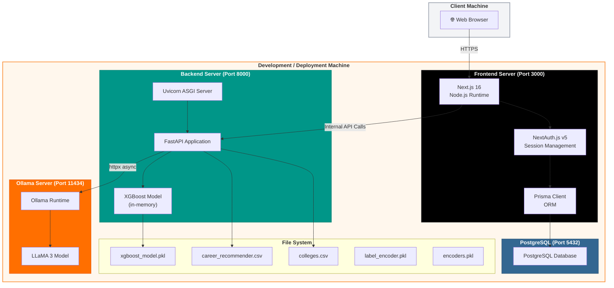

---

## Figure 13: Gantt Chart

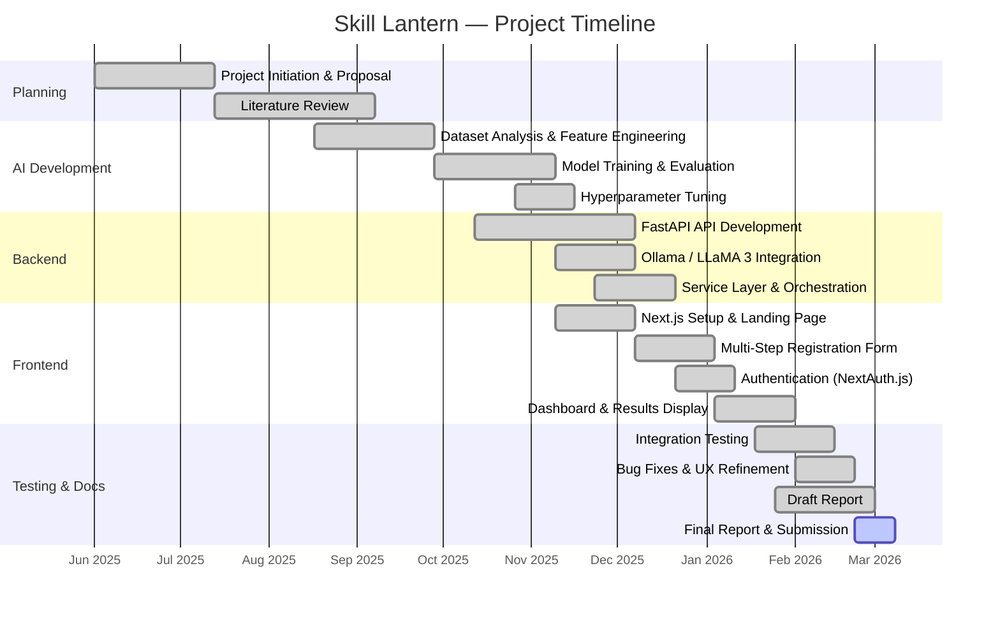

---

## Figure 14: Landing Page Wireframe (Low-Fidelity)

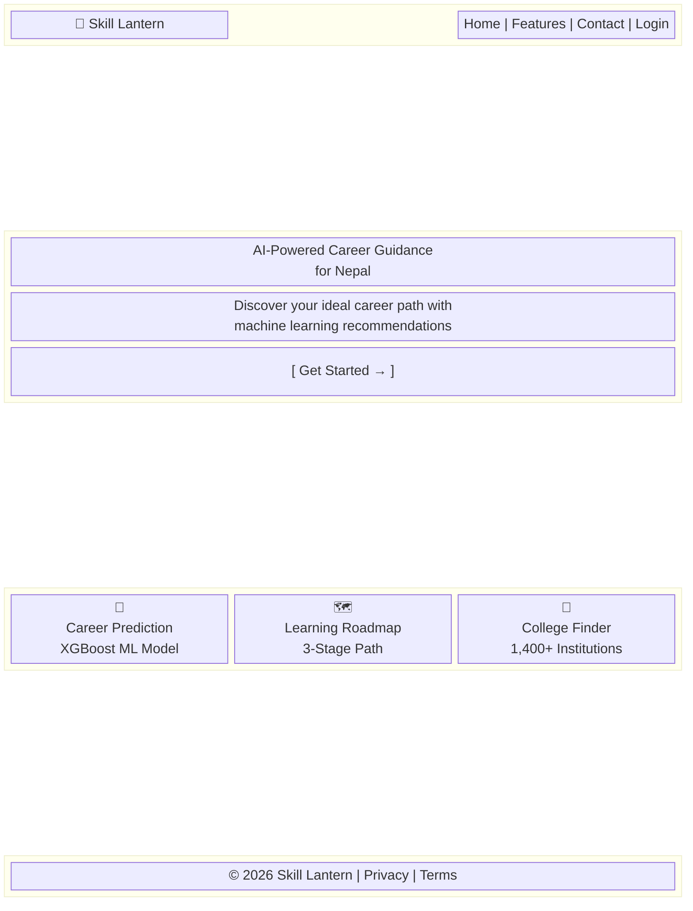

---

## Figure 15: Signup Form Wireframe (Multi-Step)

```mermaid
flowchart LR
    subgraph Step1["Step 1: Personal Info"]
        S1F1["Full Name: [________]"]
        S1F2["Gender: [Dropdown ▼]"]
        S1F3["Date of Birth: [__/__/____]"]
        S1F4["City/Region: [________]"]
    end

    subgraph Step2["Step 2: Education"]
        S2F1["Course Category: [Dropdown ▼]"]
        S2F2["Course: [________]"]
        S2F3["Specialisation: [________]"]
        S2F4["College Name: [________]"]
        S2F5["CGPA: [____]"]
    end

    subgraph Step3["Step 3: Skills"]
        S3F1["Technical Skills:<br/>☐ Python  ☐ JavaScript<br/>☐ React  ☐ SQL<br/>☐ Machine Learning<br/>☐ ...more"]
    end

    subgraph Step4["Step 4: Interests"]
        S4F1["Interests:<br/>☐ Web Development<br/>☐ Data Science<br/>☐ Cybersecurity<br/>☐ AI/ML<br/>☐ ...more"]
    end

    subgraph Step5["Step 5: Certifications"]
        S5F1["Has Certifications? [Yes/No]"]
        S5F2["Certification Details:<br/>[________________]"]
    end

    subgraph Step6["Step 6: Preferences"]
        S6F1["Career Lifestyle: [Dropdown ▼]"]
        S6F2["Work Environment: [Dropdown ▼]"]
        S6F3["Location Pref: [Dropdown ▼]"]
        S6F4["Learning Style: [Dropdown ▼]"]
    end

    Step1 -->|"Next →"| Step2
    Step2 -->|"Next →"| Step3
    Step3 -->|"Next →"| Step4
    Step4 -->|"Next →"| Step5
    Step5 -->|"Next →"| Step6
    Step6 -->|"Submit ✓"| Done(["Registration<br/>Complete"])

    style Done fill:#10B981,stroke:#059669,color:#fff
```

---

## Figure 16: Dashboard Wireframe

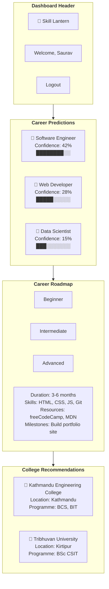

---

## Figure 17: XGBoost Ensemble Visualisation (Conceptual)

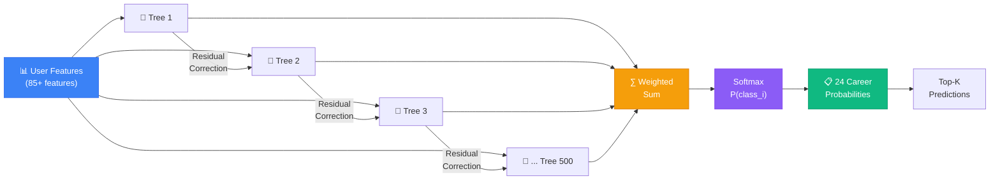

---

## Figure 18: State Diagram — User Session

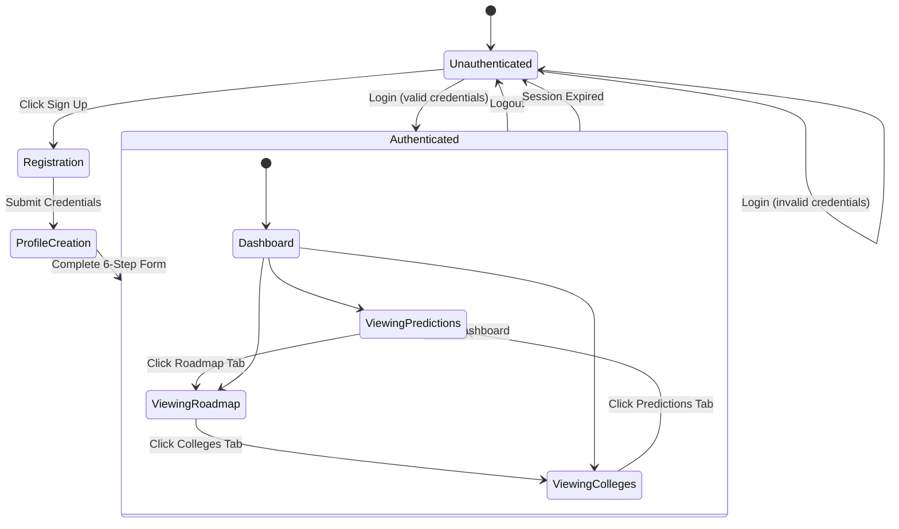

---

## Figure 19: Component Diagram — Frontend Architecture

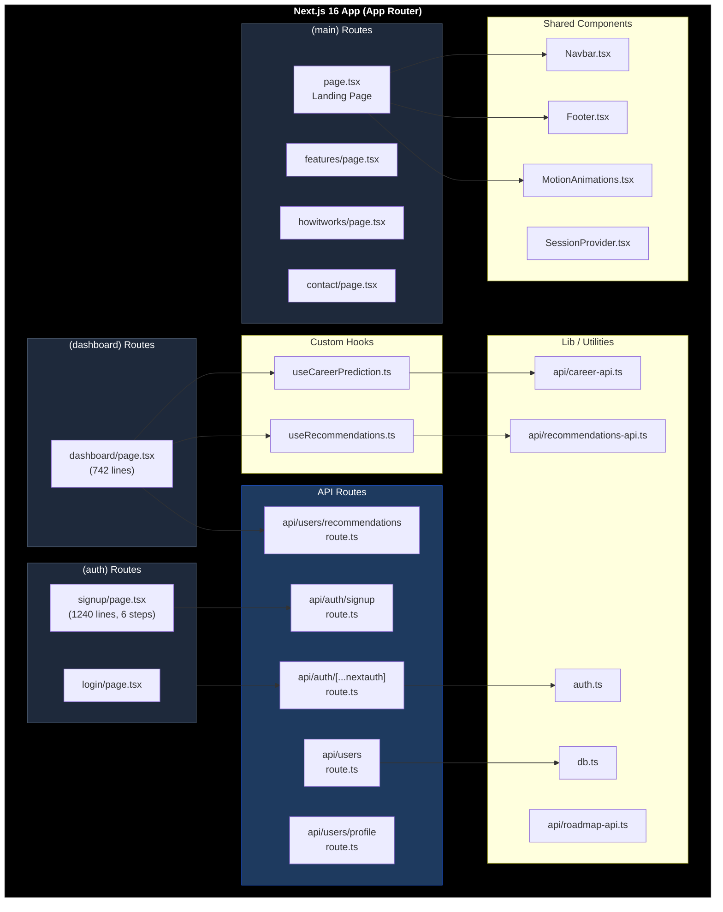

---

## Figure 20: Backend Router Architecture

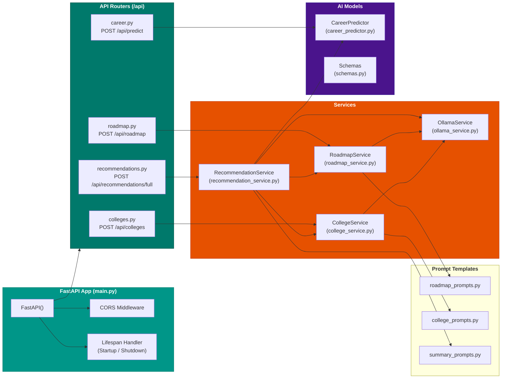
