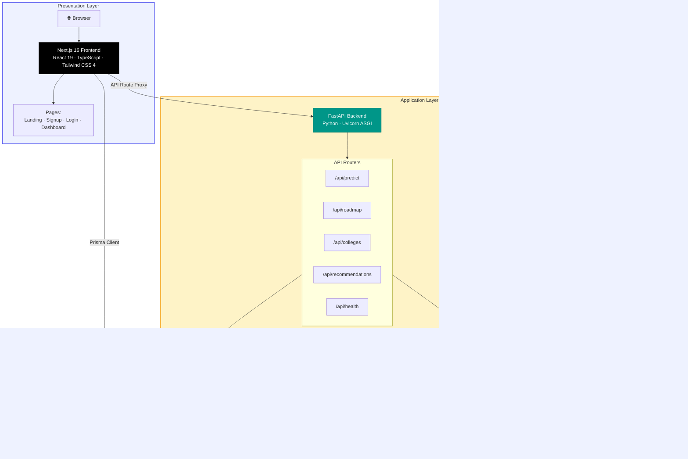
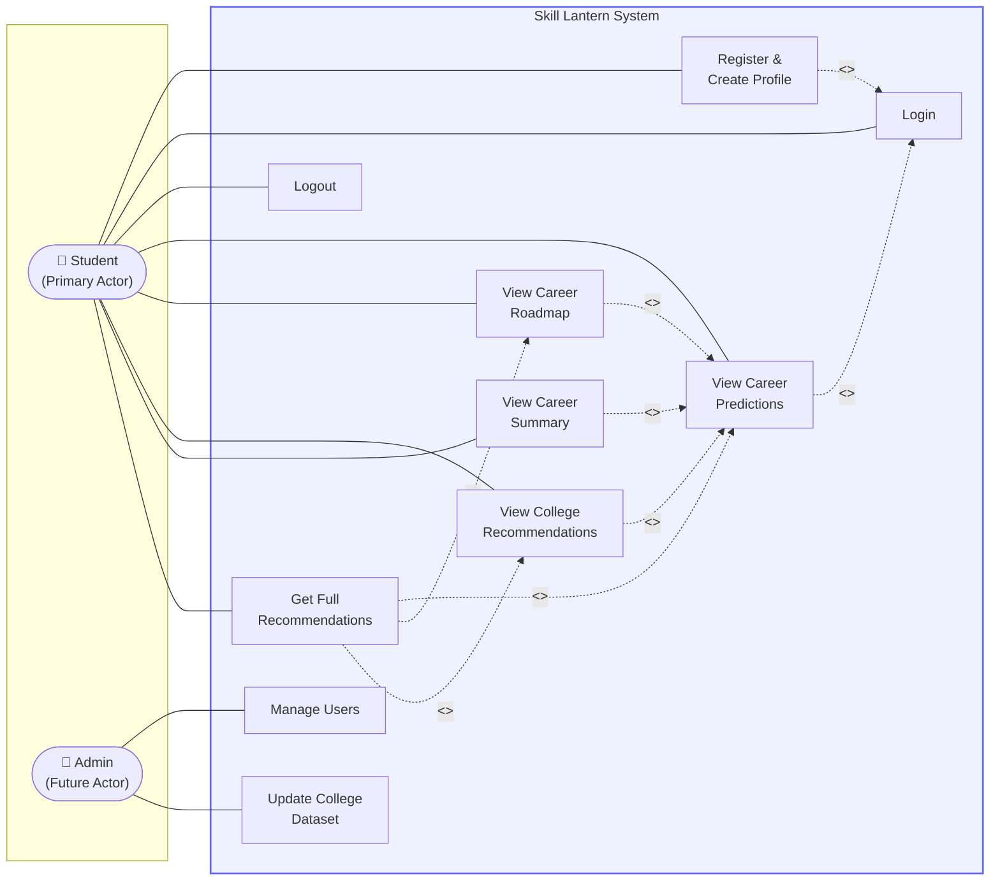
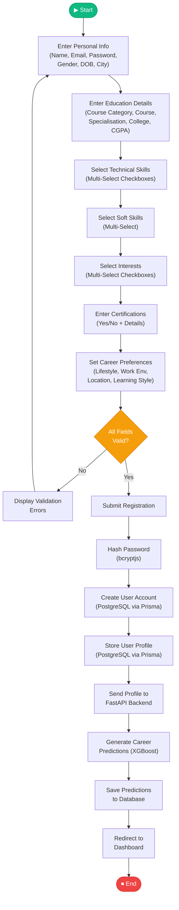
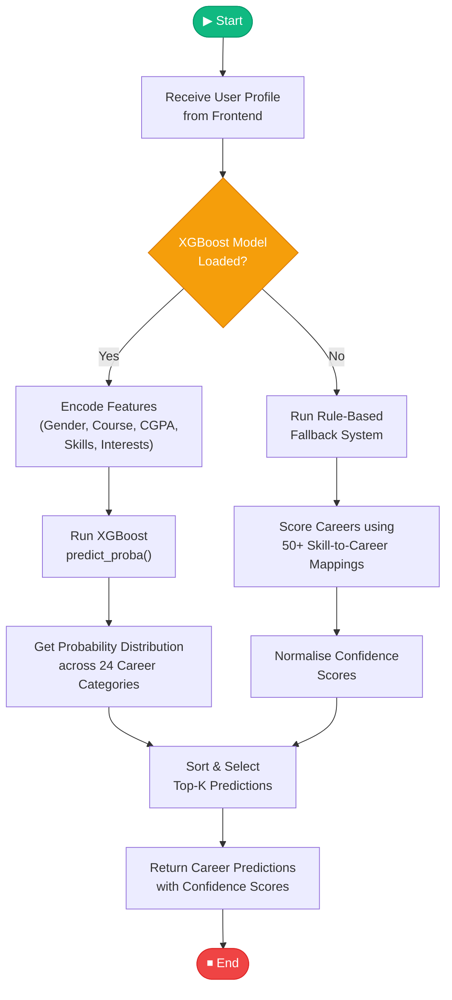
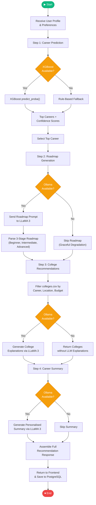
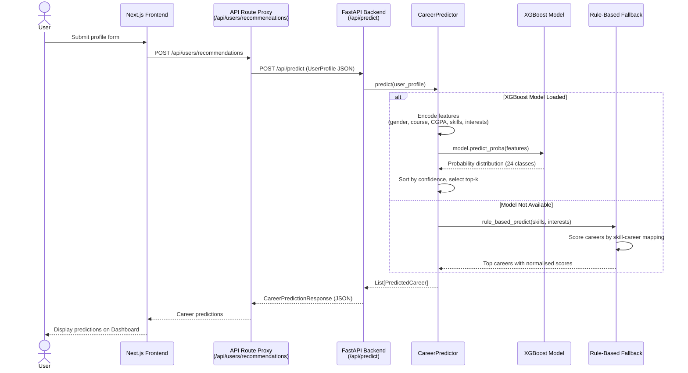
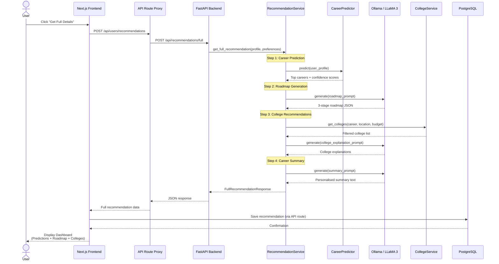
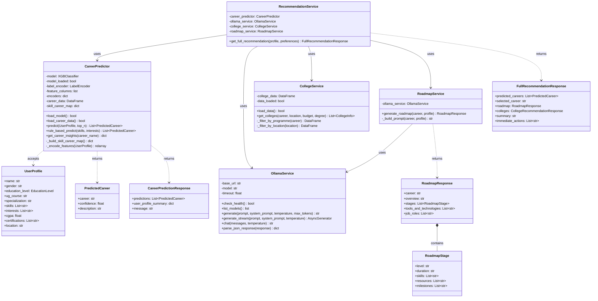
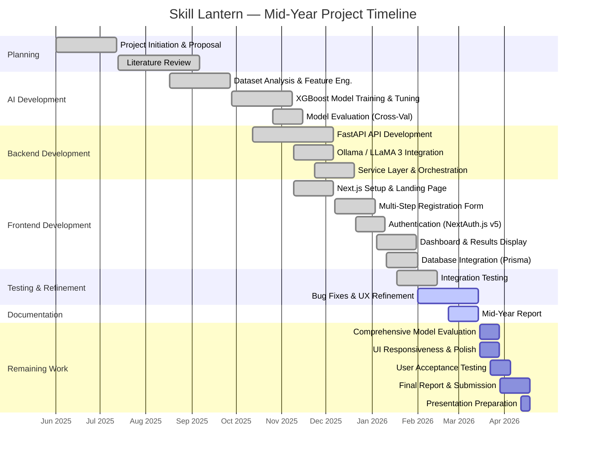

# Skill Lantern — Mid-Year Report Diagrams (Mermaid Code)

> **How to use:** Copy each code block into [Mermaid Live Editor](https://mermaid.live), render it, then export as **PNG** and paste into the DOCX report at the corresponding placeholder.

---

## 1. System Architecture Diagram



---

## 2. Use Case Diagram



---

## 3. Activity Diagram — User Registration and Profile Creation



---

## 4. Activity Diagram — Career Recommendation Generation



---

## 5. Activity Diagram — Full Recommendation Flow (Prediction + Roadmap + Colleges)



---

## 6. Sequence Diagram — Career Prediction Flow



---

## 7. Sequence Diagram — Full Recommendation Flow



---

## 8. Entity Relationship (ER) Diagram

```mermaid
erDiagram
    User {
        string id PK "cuid()"
        string name
        string email UK
        datetime emailVerified
        string image
        string password "bcrypt hashed"
        datetime createdAt
        datetime updatedAt
    }

    UserProfile {
        string id PK "cuid()"
        string userId FK UK
        string fullName
        string gender
        datetime dateOfBirth
        string cityRegion
        string courseCategory
        string course
        string specialization
        string schoolCollegeName
        float cgpa
        string_array interests
        string_array technicalSkills
        string_array softSkills
        boolean hasCertification
        string certifications
        string careerLifestyle
        string workEnvironment
        string locationPreference
        string learningStyle
        datetime createdAt
        datetime updatedAt
    }

    CareerRecommendation {
        string id PK "cuid()"
        string userId FK
        json predictions "career + confidence array"
        string topCareer
        json roadmap "stages + tools + roles"
        json colleges "college recommendations"
        string summary "LLM-generated text"
        string_array immediateActions
        boolean hasFullDetails
        datetime createdAt
        datetime updatedAt
    }

    Account {
        string id PK "cuid()"
        string userId FK
        string type
        string provider
        string providerAccountId
        string refresh_token
        string access_token
        int expires_at
    }

    Session {
        string id PK "cuid()"
        string sessionToken UK
        string userId FK
        datetime expires
    }

    VerificationToken {
        string identifier
        string token UK
        datetime expires
    }

    User ||--o| UserProfile : "has one"
    User ||--o{ CareerRecommendation : "has many"
    User ||--o{ Account : "has many"
    User ||--o{ Session : "has many"
```

---

## 9. Class Diagram



---

## 10. Gantt Chart (Mid-Year Timeline)



---

## Instructions for Exporting

1. Go to **[mermaid.live](https://mermaid.live)**
2. Paste one code block at a time (without the triple backticks)
3. The diagram renders on the right panel
4. Click the **Export** button (download icon) → choose **PNG** or **SVG**
5. Insert the exported image into the DOCX report at the matching red `[INSERT SCREENSHOT: ...]` placeholder
